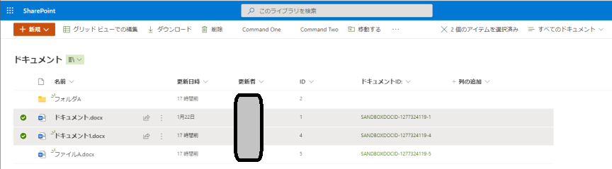

# What's This ?

SharePoint上のファイルパスを取得し、Markdown 形式の `[代替文字列](Hyperlink)` の文字列を表示するブックマークレット  

# Usage

## Install

SharePointSelections.js の内容をブックマークレットとブラウザに保存する(名称は任意)  

## Run

1. SharePoint でリンクを取得したいアイテムを選択する  
  
2. ブックマークから登録した SharePointSelections.js をクリックする  
3. プロンプトに作成した文字列が表示されるので、コピーして利用する

# Limitation

プロンプトに表示できる行数がブラウザに依って制限されているため、4, 5 行くらいを上回る行数を取得したい場合は、プロンプトで OK を押した後にブラウザの開発ツール (`F12` で起動) を起動し、コンソールに表示された文字列を利用する  
