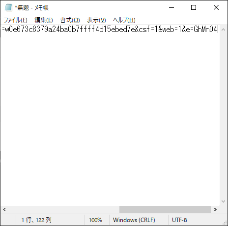
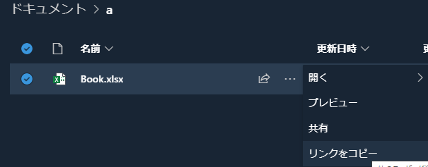
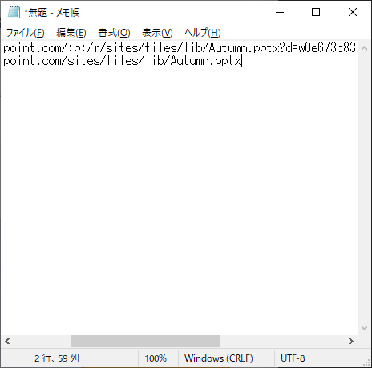

# What's This ?

クリップボードに保存した SharePoint 上のファイルのリンクから、親パスとファイルパスそれぞれの URL 文字列を生成してクリップボードに入れなおす

# Usage

1. 目的のファイルの直接リンクを下図のようにコピーする  

     

2. 適当なテキストファイルを開き、コピーしたリンク文字列を貼り付ける

     

3. 目的のファイルのリンクを下図のようにコピーする

     

4. 手順 2. で作成したテキストファイルの 2 行目に、コピーしたリンク文字列を貼り付ける

     

5. 作成したテキスト 2 行すべてを選択し、Ctrl + C でクリップボードにコピーする
6. `ShapingSharePointHyperLinkToMarkdown.bat` を実行する
