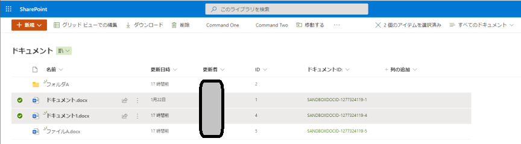

# What's This ?

SharePoint上のファイルパスを取得し、Markdown 形式の `[代替文字列](Hyperlink)` の文字列を表示するブックマークレット  

# Usage

## Install

SharePointSelectionsToMarkdown.js の内容をブックマークレットとしてブラウザに登録する(名称は任意)  

## Run

1. SharePoint でリンクを取得したいアイテムを選択する  
  
2. ブックマークから登録した SharePointSelections.js をクリックする  
3. モーダルに作成した文字列が表示されるので、コピーして利用する  
