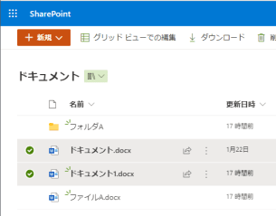

# What's This ?

Bookmarklet that retrieves the file path on SharePoint and displays the `[anchor text](Hyperlink)` string in Markdown format.   

# Usage

## Install

Register the contents of ClipSharePointSelectionsAsMarkdown.js in the browser as a bookmarklet (Bookmark name is arbitrary).  

## Run

1. Select the item(s) you want to get a link for in SharePoint  
  
2. Click the registered Bookmarklet  
3. Since the created character string is displayed in the modal, Press OK to copy to clipboard.    
